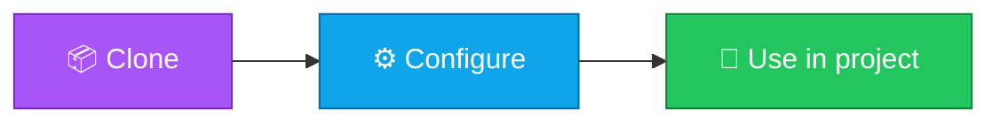

<p align="center">
  
</p>

<h1 align="center">k8s-manifests-starter</h1>

<p align="center">
  <strong>EN</strong> Example Deployment, Service, and Ingress manifests.<br/>
  <strong>PT</strong> Exemplos de manifests Deployment, Service e Ingress.
</p>

<p align="center">
  <a href="https://github.com/manansbdb/k8s-manifests-starter/blob/main/LICENSE"></a>
  
  
  <a href="#support--apoio"></a>
</p>

---

## What it does / Para que serve

| English | Português |
|---------|-----------|
| Example Deployment, Service, and Ingress manifests. | Exemplos de manifests Deployment, Service e Ingress. |



---

## Install / Instalação

### 1) Clone

```bash
git clone https://github.com/manansbdb/k8s-manifests-starter.git
cd k8s-manifests-starter
```

### Use / Usar

```bash
kubectl apply -f manifests/
```

### Requirements / Requisitos

- `git`
- No paid services required / Sem serviços pagos

---

## What's included / O que inclui

| File | EN | PT |
|------|----|----|
| `manifests/deployment.yaml` | App Deployment | Deployment da app |
| `manifests/service.yaml` | ClusterIP Service | Service ClusterIP |
| `manifests/ingress.yaml` | Ingress example | Exemplo de Ingress |

## Usage / Uso

```bash
kubectl apply -f manifests/
```

**EN:** Replace image, host, and labels for your environment.

**PT:** Substitui image, host e labels para o teu ambiente.

---

## Support / Apoio

Bitcoin donations welcome / Doações em Bitcoin bem-vindas:

```
bc1q0qfnlnxyum9u45stzxe0a7jnhtj4j0usfkqdjw
```

**Network / Rede:** BTC (Bech32).

---

## License / Licença

[MIT](./LICENSE) © 2026 manansbdb
